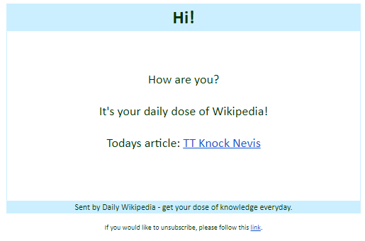

# Daily Wiki
> Subscribe and get random article from Wikipeda every morning! 

## Table of contents
* [General info](#general-info)
* [Screenshots](#screenshots)
* [Technologies](#technologies)
* [Setup](#setup)
* [Features](#features)
* [Status](#status)
* [Contact](#contact)

## General info
Project made for educational purposes, to learn basic database management, sending emails and web scraping with Python.
Project tasks:
	* Subscribers get one email per day containing random article from Wikipedia
	* Subscribers e-mail adresses are stored in sqlite database
	* History of sent articles also stored in database 
	* Subscription managent - web page with form to start/end subsciption

## Screenshots

## Technologies
* Pyhon - version 3.8

* yagmail - version 0.11.224 
* urllib3 - version 1.25.7
* keyring - version 20.0.0

## Setup
Just download all files (/draft optional) and start daily_wiky.py

## Features
Most important features - done and to-do:
Done:
* Creation of database
* Connection to database
* DB management 
* Message generation
* Manual message sending

To do:
* Automatic sending of messege everyday 
* Web page for subscribers handling

## Status
As and educational project, it's in constant development.

## Contact
Created by [pierkoo](mailto:pierkoo@gmail.com) - feel free to contact me!
